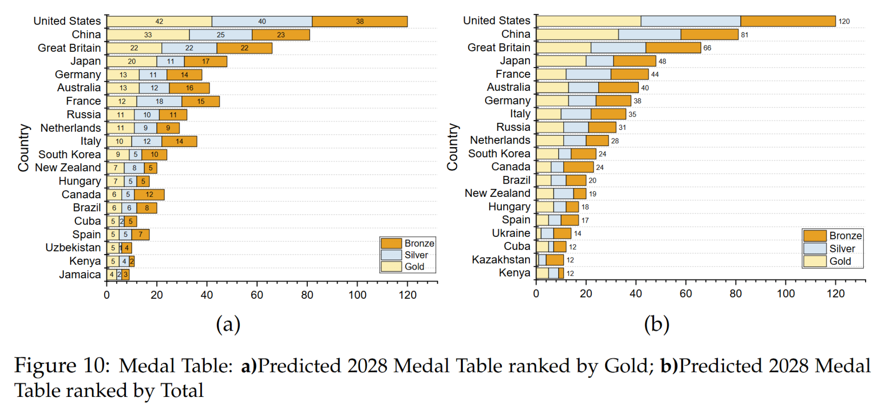
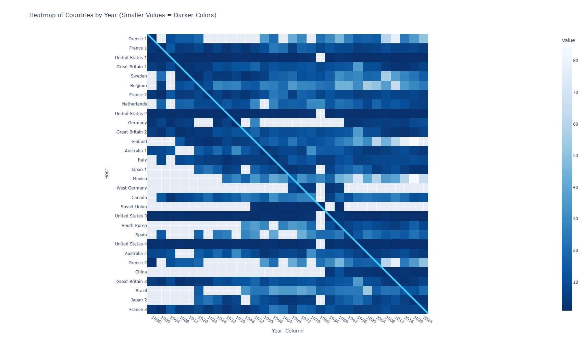

# Beyond the Numbers

### Predicting Olympic Medal Futures with Word2Vec and Ensemble Learning

🏅 2025 MCM/ICM Problem C — Meritorious Winner (M Prize)

---

## Overview

This repository contains our solution to the 2025 Mathematical Contest in Modeling (MCM/ICM) Problem C.

We propose a machine-learning framework for Olympic medal forecasting by integrating:

- Word2Vec semantic embedding
- Random Forest ensemble regression
- Host-country effect analysis
- Great coach effect modeling
- Medal breakthrough probability estimation

The framework was developed to predict medal distributions for the 2028 Los Angeles Olympic Games.

---

## Framework

<p align="center">
  
</p>

---

## Key Results

### Predicted 2028 Medal Table

<p align="center">
  
</p>

### Host Effect Analysis

<p align="center">
  
</p>

The model predicts:
- 93 medal-winning countries in the 2028 Olympics
- United States leading with 120 total medals
- Several potential 0→1 breakthrough nations, including Honduras and Samoa

---

## Methods

- Data Cleaning & EDA
- Feature Engineering
- Word2Vec (CBOW & Skip-gram)
- Random Forest Regression
- Host Effect Analysis
- Great Coach Effect Modeling

---

## Repository Structure

```text
paper/      Final paper
assets/     Figures used in README
```

---

## Paper

📄 [Beyond_the_Numbers.pdf](paper/Beyond_the_Numbers.pdf)

---

## Citation

```bibtex
@misc{mcm2025olympic,
  title={Beyond the Numbers: Predicting Olympic Medal Futures with Word2Vec and Ensemble Learning},
  author={Team 2518380},
  year={2025}
}
```

---

## Acknowledgement

This work was completed for the 2025 MCM/ICM competition.
