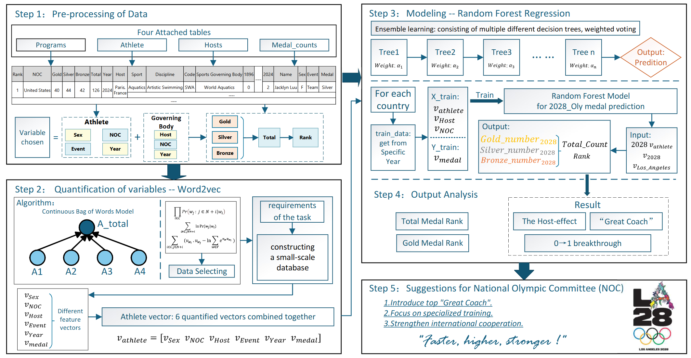

# Beyond the Numbers

### Predicting Olympic Medal Futures with Word2Vec and Ensemble Learning

🏅 2025 MCM/ICM Problem C — Meritorious Winner (M Prize)

---

## Overview

This repository contains our solution to the 2025 Mathematical Contest in Modeling (MCM/ICM) Problem C.

We developed a machine-learning framework for Olympic medal prediction by combining:

- Word2Vec semantic feature quantification
- Random Forest ensemble regression
- Host-country effect analysis
- Great coach effect modeling
- Medal breakthrough probability estimation

The model was used to forecast medal distributions for the 2028 Los Angeles Olympic Games.

---

## Highlights

- Predicted medal outcomes for 93 countries in the 2028 Olympics
- Built a 100-tree Random Forest regression framework
- Quantified Olympic entities using Word2Vec embeddings
- Analyzed host-country and coaching effects
- Proposed strategic recommendations for National Olympic Committees (NOCs)

---

## Framework

<p align="center">
  
</p>

---

## Key Results

### Predicted Top Nations (2028)

| Country | Total Medals |
|---|---|
| United States | 120 |
| China | 81 |
| Great Britain | 66 |
| Japan | 48 |
| France | 44 |

### Potential 0→1 Medal Breakthrough Countries

- Honduras
- Samoa
- Guinea
- Mali

---

## Repository Structure

```text
paper/      Final paper
assets/     Figures and visual materials
```

---

## Paper

📄 [Beyond_the_Numbers.pdf](paper/Beyond_the_Numbers.pdf)

---

## Methods

- Feature Engineering
- Exploratory Data Analysis (EDA)
- Word2Vec (CBOW & Skip-gram)
- Random Forest Regression
- Host Effect Analysis
- Great Coach Effect Modeling

---

## Citation

```bibtex
@misc{mcm2025olympic,
  title={Beyond the Numbers: Predicting Olympic Medal Futures with Word2Vec and Ensemble Learning},
  author={Team 2518380},
  year={2025}
}
```

---

## Acknowledgement

This work was completed for the 2025 MCM/ICM competition.
